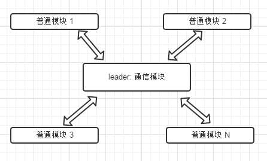
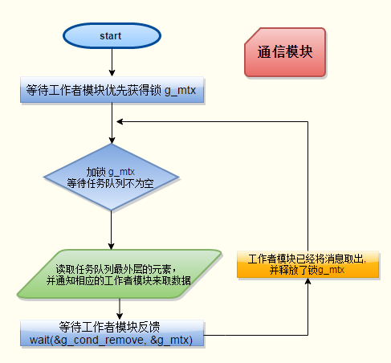
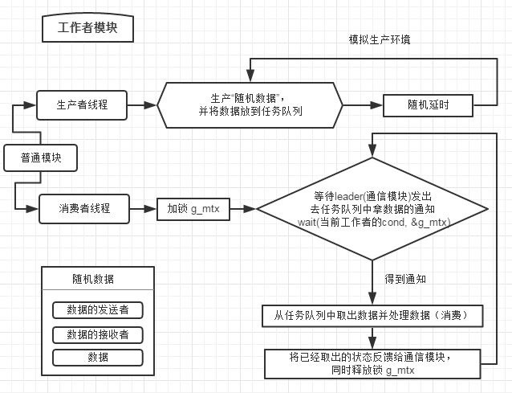

#模块(线程)间通信模型

### Communication model between modules(threads)
1. 高效安全的线程间消息传递模型
2. 基于生产者消费者模型

### Illustration

### Demo

<pre><code>
    Thread* ts1 = new ThreadStuff("模块1"); 
    Thread* ts2 = new ThreadStuff("模块2", 0.8);
    Thread* ts3 = new ThreadStuff("模块3", 3);
    Thread* ts4 = new ThreadStuff("模块4", 5.1f);
    // 模块标识符可任意写，只要不和其他的重复
    Thread* ts5 = new ThreadStuff("模五 ", 3);
  
    ts1->start();
    ts2->start();
    ts3->start();
    ts4->start(); 
    ts5->start();

    //  准备就绪开始通信
    ThreadStuff::start_comm();
    getchar();
    delete ts1;
    delete ts2;
    delete ts3;
    delete ts4; delete ts5;
</code></pre>

##### 运行截图

<pre>

$ ./demo
模块1 thread_msg 线程启动；
模块1 thread_msg: 欲要加锁;
模块1 thread_msg: 已经持有锁;
模块1 wait(自己的cond), 并释放锁;
模五  thread_msg 线程启动；
模五  thread_msg: 欲要加锁;
模块2 thread_msg 线程启动；模块3 thread_msg 线程启动；
模块4 thread_msg 线程启动；模五  thread_msg: 已经持有锁;
模块2 thread_msg: 欲要加锁;模块3 thread_msg: 欲要加锁;
模块4 thread_msg: 欲要加锁;模五  wait(自己的cond), 并释放锁;
模块2 thread_msg: 已经持有锁;
模块2 wait(自己的cond), 并释放锁;
模块3 thread_msg: 已经持有锁;
模块3 wait(自己的cond), 并释放锁;
模块4 thread_msg: 已经持有锁;
模块4 wait(自己的cond), 并释放锁;
通信模块 要加锁;
通信模块 持有了锁;
通信模块 通知模块3来取数据;
通信模块 等待 cond_remove, 并释放了锁;
模块3 等到了自己的cond， 并重新持有锁;
"模块3"得到来自"模块1"的数据: 43
模块3 数据已取出，唤醒 cond_remove;
模块3 wait(自己的cond), 并释放锁;
通信模块 等到了 cond_remove, 并重新加上了锁;
---------------------------当前队列的长度:27
通信模块 通知模块3来取数据;
通信模块 等待 cond_remove, 并释放了锁;
模块3 等到了自己的cond， 并重新持有锁;
"模块3"得到来自"模五 "的数据: 43
模块3 数据已取出，唤醒 cond_remove;
模块3 wait(自己的cond), 并释放锁;
通信模块 等到了 cond_remove, 并重新加上了锁;
---------------------------当前队列的长度:26
通信模块 通知模块3来取数据;
通信模块 等待 cond_remove, 并释放了锁;
模块3 等到了自己的cond， 并重新持有锁;
"模块3"得到来自"模块2"的数据: 43
模块3 数据已取出，唤醒 cond_remove;
模块3 wait(自己的cond), 并释放锁;
通信模块 等到了 cond_remove, 并重新加上了锁;
---------------------------当前队列的长度:25
通信模块 通知模块3来取数据;
通信模块 等待 cond_remove, 并释放了锁;
模块3 等到了自己的cond， 并重新持有锁;
"模块3"得到来自"模块3"的数据: 43
模块3 数据已取出，唤醒 cond_remove;
模块3 wait(自己的cond), 并释放锁;
通信模块 等到了 cond_remove, 并重新加上了锁;
---------------------------当前队列的长度:24
通信模块 通知模块3来取数据;
通信模块 等待 cond_remove, 并释放了锁;
模块3 等到了自己的cond， 并重新持有锁;
"模块3"得到来自"模块4"的数据: 43
模块3 数据已取出，唤醒 cond_remove;
模块3 wait(自己的cond), 并释放锁;
通信模块 等到了 cond_remove, 并重新加上了锁;
---------------------------当前队列的长度:23
通信模块 通知模块4来取数据;
通信模块 等待 cond_remove, 并释放了锁;
模块4 等到了自己的cond， 并重新持有锁;
"模块4"得到来自"模块1"的数据: 0
模块4 数据已取出，唤醒 cond_remove;
模块4 wait(自己的cond), 并释放锁;
通信模块 等到了 cond_remove, 并重新加上了锁;
---------------------------当前队列的长度:22
通信模块 通知模块2来取数据;
通信模块 等待 cond_remove, 并释放了锁;
模块2 等到了自己的cond， 并重新持有锁;
"模块2"得到来自"模块1"的数据: 56
模块2 数据已取出，唤醒 cond_remove;
模块2 wait(自己的cond), 并释放锁;
通信模块 等到了 cond_remove, 并重新加上了锁;
---------------------------当前队列的长度:21
通信模块 通知模块4来取数据;
通信模块 等待 cond_remove, 并释放了锁;
模块4 等到了自己的cond， 并重新持有锁;
"模块4"得到来自"模块1"的数据: 11
模块4 数据已取出，唤醒 cond_remove;
模块4 wait(自己的cond), 并释放锁;
通信模块 等到了 cond_remove, 并重新加上了锁;
---------------------------当前队列的长度:20
通信模块 通知模块3来取数据;
通信模块 等待 cond_remove, 并释放了锁;
模块3 等到了自己的cond， 并重新持有锁;
"模块3"得到来自"模块1"的数据: 5
模块3 数据已取出，唤醒 cond_remove;
模块3 wait(自己的cond), 并释放锁;
通信模块 等到了 cond_remove, 并重新加上了锁;
---------------------------当前队列的长度:19
通信模块 通知模块3来取数据;
通信模块 等待 cond_remove, 并释放了锁;
模块3 等到了自己的cond， 并重新持有锁;
"模块3"得到来自"模块1"的数据: 30
模块3 数据已取出，唤醒 cond_remove;
模块3 wait(自己的cond), 并释放锁;
通信模块 等到了 cond_remove, 并重新加上了锁;
---------------------------当前队列的长度:18
通信模块 通知模块4来取数据;
通信模块 等待 cond_remove, 并释放了锁;
模块4 等到了自己的cond， 并重新持有锁;
"模块4"得到来自"模块1"的数据: 32
模块4 数据已取出，唤醒 cond_remove;
模块4 wait(自己的cond), 并释放锁;
通信模块 等到了 cond_remove, 并重新加上了锁;
---------------------------当前队列的长度:17
通信模块 通知模块2来取数据;
通信模块 等待 cond_remove, 并释放了锁;
模块2 等到了自己的cond， 并重新持有锁;
"模块2"得到来自"模块1"的数据: 72
模块2 数据已取出，唤醒 cond_remove;
模块2 wait(自己的cond), 并释放锁;
通信模块 等到了 cond_remove, 并重新加上了锁;
---------------------------当前队列的长度:16
通信模块 通知模块4来取数据;
通信模块 等待 cond_remove, 并释放了锁;
模块4 等到了自己的cond， 并重新持有锁;
"模块4"得到来自"模块4"的数据: 0
模块4 数据已取出，唤醒 cond_remove;
模块4 wait(自己的cond), 并释放锁;
通信模块 等到了 cond_remove, 并重新加上了锁;
---------------------------当前队列的长度:15
通信模块 通知模五 来取数据;
通信模块 等待 cond_remove, 并释放了锁;
模五  等到了自己的cond， 并重新持有锁;
"模五 "得到来自"模块1"的数据: 23
模五  数据已取出，唤醒 cond_remove;
模五  wait(自己的cond), 并释放锁;
通信模块 等到了 cond_remove, 并重新加上了锁;
---------------------------当前队列的长度:14
通信模块 通知模块2来取数据;
通信模块 等待 cond_remove, 并释放了锁;
模块2 等到了自己的cond， 并重新持有锁;
"模块2"得到来自"模块1"的数据: 64
模块2 数据已取出，唤醒 cond_remove;
模块2 wait(自己的cond), 并释放锁;
通信模块 等到了 cond_remove, 并重新加上了锁;
---------------------------当前队列的长度:13
通信模块 通知模块1来取数据;
通信模块 等待 cond_remove, 并释放了锁;
模块1 等到了自己的cond， 并重新持有锁;
"模块1"得到来自"模块1"的数据: 27
模块1 数据已取出，唤醒 cond_remove;
模块1 wait(自己的cond), 并释放锁;
通信模块 等到了 cond_remove, 并重新加上了锁;
---------------------------当前队列的长度:12
通信模块 通知模块4来取数据;
通信模块 等待 cond_remove, 并释放了锁;
模块4 等到了自己的cond， 并重新持有锁;
"模块4"得到来自"模块1"的数据: 35
模块4 数据已取出，唤醒 cond_remove;
模块4 wait(自己的cond), 并释放锁;
通信模块 等到了 cond_remove, 并重新加上了锁;
---------------------------当前队列的长度:11
通信模块 通知模块4来取数据;
通信模块 等待 cond_remove, 并释放了锁;
模块4 等到了自己的cond， 并重新持有锁;
"模块4"得到来自"模块1"的数据: 10
模块4 数据已取出，唤醒 cond_remove;
模块4 wait(自己的cond), 并释放锁;
通信模块 等到了 cond_remove, 并重新加上了锁;
---------------------------当前队列的长度:10
通信模块 通知模块4来取数据;
通信模块 等待 cond_remove, 并释放了锁;
模块4 等到了自己的cond， 并重新持有锁;
"模块4"得到来自"模块1"的数据: 63
模块4 数据已取出，唤醒 cond_remove;
模块4 wait(自己的cond), 并释放锁;
通信模块 等到了 cond_remove, 并重新加上了锁;
---------------------------当前队列的长度:9
通信模块 通知模五 来取数据;
通信模块 等待 cond_remove, 并释放了锁;
模五  等到了自己的cond， 并重新持有锁;
"模五 "得到来自"模块1"的数据: 36
模五  数据已取出，唤醒 cond_remove;
模五  wait(自己的cond), 并释放锁;
通信模块 等到了 cond_remove, 并重新加上了锁;
---------------------------当前队列的长度:8
通信模块 通知模块4来取数据;
通信模块 等待 cond_remove, 并释放了锁;
模块4 等到了自己的cond， 并重新持有锁;
"模块4"得到来自"模块2"的数据: 0
模块4 数据已取出，唤醒 cond_remove;
模块4 wait(自己的cond), 并释放锁;
通信模块 等到了 cond_remove, 并重新加上了锁;
---------------------------当前队列的长度:7
通信模块 通知模块1来取数据;
通信模块 等待 cond_remove, 并释放了锁;
模块1 等到了自己的cond， 并重新持有锁;
"模块1"得到来自"模块1"的数据: 29
模块1 数据已取出，唤醒 cond_remove;
模块1 wait(自己的cond), 并释放锁;
通信模块 等到了 cond_remove, 并重新加上了锁;
---------------------------当前队列的长度:6
通信模块 通知模五 来取数据;
通信模块 等待 cond_remove, 并释放了锁;
模五  等到了自己的cond， 并重新持有锁;
"模五 "得到来自"模块1"的数据: 91
模五  数据已取出，唤醒 cond_remove;
模五  wait(自己的cond), 并释放锁;
通信模块 等到了 cond_remove, 并重新加上了锁;
---------------------------当前队列的长度:5
通信模块 通知模块4来取数据;
通信模块 等待 cond_remove, 并释放了锁;
模块4 等到了自己的cond， 并重新持有锁;
"模块4"得到来自"模块1"的数据: 34
模块4 数据已取出，唤醒 cond_remove;
模块4 wait(自己的cond), 并释放锁;
通信模块 等到了 cond_remove, 并重新加上了锁;
---------------------------当前队列的长度:4
通信模块 通知模块4来取数据;
通信模块 等待 cond_remove, 并释放了锁;
模块4 等到了自己的cond， 并重新持有锁;
"模块4"得到来自"模块1"的数据: 30
模块4 数据已取出，唤醒 cond_remove;
模块4 wait(自己的cond), 并释放锁;
通信模块 等到了 cond_remove, 并重新加上了锁;
---------------------------当前队列的长度:3
通信模块 通知模块1来取数据;
通信模块 等待 cond_remove, 并释放了锁;
模块1 等到了自己的cond， 并重新持有锁;
"模块1"得到来自"模块1"的数据: 43
模块1 数据已取出，唤醒 cond_remove;
模块1 wait(自己的cond), 并释放锁;
通信模块 等到了 cond_remove, 并重新加上了锁;
---------------------------当前队列的长度:2
通信模块 通知模块4来取数据;
通信模块 等待 cond_remove, 并释放了锁;
模块4 等到了自己的cond， 并重新持有锁;
"模块4"得到来自"模块1"的数据: 60
模块4 数据已取出，唤醒 cond_remove;
模块4 wait(自己的cond), 并释放锁;
通信模块 等到了 cond_remove, 并重新加上了锁;
---------------------------当前队列的长度:1
通信模块 通知模五 来取数据;
通信模块 等待 cond_remove, 并释放了锁;
模五  等到了自己的cond， 并重新持有锁;
"模五 "得到来自"模块1"的数据: 56
模五  数据已取出，唤醒 cond_remove;
模五  wait(自己的cond), 并释放锁;
通信模块 等到了 cond_remove, 并重新加上了锁;
---------------------------当前队列的长度:0
通信模块 通知模块2来取数据;
通信模块 等待 cond_remove, 并释放了锁;
模块2 等到了自己的cond， 并重新持有锁;
"模块2"得到来自"模块1"的数据: 13
模块2 数据已取出，唤醒 cond_remove;
模块2 wait(自己的cond), 并释放锁;
通信模块 等到了 cond_remove, 并重新加上了锁;
---------------------------当前队列的长度:0
通信模块 通知模块4来取数据;
通信模块 等待 cond_remove, 并释放了锁;
模块4 等到了自己的cond， 并重新持有锁;
"模块4"得到来自"模块1"的数据: 19
模块4 数据已取出，唤醒 cond_remove;
模块4 wait(自己的cond), 并释放锁;
通信模块 等到了 cond_remove, 并重新加上了锁;
---------------------------当前队列的长度:0
通信模块 通知模五 来取数据;
通信模块 等待 cond_remove, 并释放了锁;
模五  等到了自己的cond， 并重新持有锁;
"模五 "得到来自"模块1"的数据: 49
模五  数据已取出，唤醒 cond_remove;
模五  wait(自己的cond), 并释放锁;
通信模块 等到了 cond_remove, 并重新加上了锁;
---------------------------当前队列的长度:0
通信模块 通知模块4来取数据;
通信模块 等待 cond_remove, 并释放了锁;
模块4 等到了自己的cond， 并重新持有锁;
"模块4"得到来自"模块1"的数据: 97
模块4 数据已取出，唤醒 cond_remove;
模块4 wait(自己的cond), 并释放锁;
通信模块 等到了 cond_remove, 并重新加上了锁;
---------------------------当前队列的长度:0
通信模块 通知模块1来取数据;
通信模块 等待 cond_remove, 并释放了锁;
模块1 等到了自己的cond， 并重新持有锁;
"模块1"得到来自"模块1"的数据: 49
模块1 数据已取出，唤醒 cond_remove;
模块1 wait(自己的cond), 并释放锁;
通信模块 等到了 cond_remove, 并重新加上了锁;
---------------------------当前队列的长度:0
通信模块 通知模块4来取数据;
通信模块 等待 cond_remove, 并释放了锁;
模块4 等到了自己的cond， 并重新持有锁;
"模块4"得到来自"模块3"的数据: 0
模块4 数据已取出，唤醒 cond_remove;
模块4 wait(自己的cond), 并释放锁;
通信模块 等到了 cond_remove, 并重新加上了锁;
---------------------------当前队列的长度:1
通信模块 通知模块4来取数据;
通信模块 等待 cond_remove, 并释放了锁;
模块4 等到了自己的cond， 并重新持有锁;
"模块4"得到来自"模五 "的数据: 0
模块4 数据已取出，唤醒 cond_remove;
模块4 wait(自己的cond), 并释放锁;
通信模块 等到了 cond_remove, 并重新加上了锁;
---------------------------当前队列的长度:0
通信模块 通知模块4来取数据;
通信模块 等待 cond_remove, 并释放了锁;
模块4 等到了自己的cond， 并重新持有锁;
"模块4"得到来自"模块1"的数据: 93
模块4 数据已取出，唤醒 cond_remove;
模块4 wait(自己的cond), 并释放锁;
通信模块 等到了 cond_remove, 并重新加上了锁;
---------------------------当前队列的长度:0
通信模块 通知模块2来取数据;
通信模块 等待 cond_remove, 并释放了锁;
模块2 等到了自己的cond， 并重新持有锁;
"模块2"得到来自"模块1"的数据: 6
模块2 数据已取出，唤醒 cond_remove;
模块2 wait(自己的cond), 并释放锁;
通信模块 等到了 cond_remove, 并重新加上了锁;
---------------------------当前队列的长度:0
通信模块 通知模块2来取数据;
通信模块 等待 cond_remove, 并释放了锁;
模块2 等到了自己的cond， 并重新持有锁;
"模块2"得到来自"模块2"的数据: 56
模块2 数据已取出，唤醒 cond_remove;
模块2 wait(自己的cond), 并释放锁;
通信模块 等到了 cond_remove, 并重新加上了锁;
---------------------------当前队列的长度:0
通信模块 通知模块4来取数据;
通信模块 等待 cond_remove, 并释放了锁;
模块4 等到了自己的cond， 并重新持有锁;
"模块4"得到来自"模块1"的数据: 52
模块4 数据已取出，唤醒 cond_remove;
模块4 wait(自己的cond), 并释放锁;
通信模块 等到了 cond_remove, 并重新加上了锁;
---------------------------当前队列的长度:0
通信模块 通知模块4来取数据;
通信模块 等待 cond_remove, 并释放了锁;
模块4 等到了自己的cond， 并重新持有锁;
"模块4"得到来自"模块2"的数据: 11
模块4 数据已取出，唤醒 cond_remove;
模块4 wait(自己的cond), 并释放锁;
通信模块 等到了 cond_remove, 并重新加上了锁;
---------------------------当前队列的长度:0
通信模块 通知模块3来取数据;
通信模块 等待 cond_remove, 并释放了锁;
模块3 等到了自己的cond， 并重新持有锁;
"模块3"得到来自"模块1"的数据: 38
模块3 数据已取出，唤醒 cond_remove;
模块3 wait(自己的cond), 并释放锁;
通信模块 等到了 cond_remove, 并重新加上了锁;
---------------------------当前队列的长度:0
通信模块 通知模五 来取数据;
通信模块 等待 cond_remove, 并释放了锁;
模五  等到了自己的cond， 并重新持有锁;
"模五 "得到来自"模块1"的数据: 30
模五  数据已取出，唤醒 cond_remove;
模五  wait(自己的cond), 并释放锁;
通信模块 等到了 cond_remove, 并重新加上了锁;
---------------------------当前队列的长度:0
通信模块 通知模五 来取数据;
通信模块 等待 cond_remove, 并释放了锁;
模五  等到了自己的cond， 并重新持有锁;
"模五 "得到来自"模块1"的数据: 56
模五  数据已取出，唤醒 cond_remove;
模五  wait(自己的cond), 并释放锁;
通信模块 等到了 cond_remove, 并重新加上了锁;
---------------------------当前队列的长度:0
通信模块 通知模块3来取数据;
通信模块 等待 cond_remove, 并释放了锁;
模块3 等到了自己的cond， 并重新持有锁;
"模块3"得到来自"模块2"的数据: 5
模块3 数据已取出，唤醒 cond_remove;
模块3 wait(自己的cond), 并释放锁;
通信模块 等到了 cond_remove, 并重新加上了锁;
---------------------------当前队列的长度:0
通信模块 通知模块1来取数据;
通信模块 等待 cond_remove, 并释放了锁;
模块1 等到了自己的cond， 并重新持有锁;
"模块1"得到来自"模块1"的数据: 27
模块1 数据已取出，唤醒 cond_remove;
模块1 wait(自己的cond), 并释放锁;
通信模块 等到了 cond_remove, 并重新加上了锁;
---------------------------当前队列的长度:0
通信模块 通知模块1来取数据;
通信模块 等待 cond_remove, 并释放了锁;
模块1 等到了自己的cond， 并重新持有锁;
"模块1"得到来自"模块1"的数据: 68
模块1 数据已取出，唤醒 cond_remove;
模块1 wait(自己的cond), 并释放锁;
通信模块 等到了 cond_remove, 并重新加上了锁;
---------------------------当前队列的长度:0
通信模块 通知模块1来取数据;
通信模块 等待 cond_remove, 并释放了锁;
模块1 等到了自己的cond， 并重新持有锁;
"模块1"得到来自"模块1"的数据: 10
模块1 数据已取出，唤醒 cond_remove;
模块1 wait(自己的cond), 并释放锁;
通信模块 等到了 cond_remove, 并重新加上了锁;
---------------------------当前队列的长度:0
通信模块 通知模块3来取数据;
通信模块 等待 cond_remove, 并释放了锁;
模块3 等到了自己的cond， 并重新持有锁;
"模块3"得到来自"模块1"的数据: 71
模块3 数据已取出，唤醒 cond_remove;
模块3 wait(自己的cond), 并释放锁;
通信模块 等到了 cond_remove, 并重新加上了锁;
---------------------------当前队列的长度:0
通信模块 通知模块3来取数据;
通信模块 等待 cond_remove, 并释放了锁;
模块3 等到了自己的cond， 并重新持有锁;
"模块3"得到来自"模块2"的数据: 30
模块3 数据已取出，唤醒 cond_remove;
模块3 wait(自己的cond), 并释放锁;
通信模块 等到了 cond_remove, 并重新加上了锁;
---------------------------当前队列的长度:0
通信模块 通知模块4来取数据;
通信模块 等待 cond_remove, 并释放了锁;
模块4 等到了自己的cond， 并重新持有锁;
"模块4"得到来自"模块1"的数据: 47
模块4 数据已取出，唤醒 cond_remove;
模块4 wait(自己的cond), 并释放锁;
通信模块 等到了 cond_remove, 并重新加上了锁;
---------------------------当前队列的长度:0
通信模块 通知模块4来取数据;
通信模块 等待 cond_remove, 并释放了锁;
模块4 等到了自己的cond， 并重新持有锁;
"模块4"得到来自"模块2"的数据: 32
模块4 数据已取出，唤醒 cond_remove;
模块4 wait(自己的cond), 并释放锁;
通信模块 等到了 cond_remove, 并重新加上了锁;
---------------------------当前队列的长度:0
通信模块 通知模块2来取数据;
通信模块 等待 cond_remove, 并释放了锁;
模块2 等到了自己的cond， 并重新持有锁;
"模块2"得到来自"模块1"的数据: 25
模块2 数据已取出，唤醒 cond_remove;
模块2 wait(自己的cond), 并释放锁;
通信模块 等到了 cond_remove, 并重新加上了锁;
---------------------------当前队列的长度:0
通信模块 通知模块1来取数据;
通信模块 等待 cond_remove, 并释放了锁;
模块1 等到了自己的cond， 并重新持有锁;
"模块1"得到来自"模块1"的数据: 18
模块1 数据已取出，唤醒 cond_remove;
模块1 wait(自己的cond), 并释放锁;
通信模块 等到了 cond_remove, 并重新加上了锁;
---------------------------当前队列的长度:0
通信模块 通知模块1来取数据;
通信模块 等待 cond_remove, 并释放了锁;
模块1 等到了自己的cond， 并重新持有锁;
"模块1"得到来自"模块1"的数据: 87
模块1 数据已取出，唤醒 cond_remove;
模块1 wait(自己的cond), 并释放锁;
通信模块 等到了 cond_remove, 并重新加上了锁;
---------------------------当前队列的长度:0
通信模块 通知模块4来取数据;
通信模块 等待 cond_remove, 并释放了锁;
模块4 等到了自己的cond， 并重新持有锁;
"模块4"得到来自"模块1"的数据: 95
模块4 数据已取出，唤醒 cond_remove;
模块4 wait(自己的cond), 并释放锁;
通信模块 等到了 cond_remove, 并重新加上了锁;
---------------------------当前队列的长度:0
通信模块 通知模五 来取数据;
通信模块 等待 cond_remove, 并释放了锁;
模五  等到了自己的cond， 并重新持有锁;
"模五 "得到来自"模块1"的数据: 13
模五  数据已取出，唤醒 cond_remove;
模五  wait(自己的cond), 并释放锁;
通信模块 等到了 cond_remove, 并重新加上了锁;
---------------------------当前队列的长度:0

</pre>

<pre>
cygwin $
cygwin $ ./demo >/dev/null 2>&1 &
[1] 13260
cygwin $ top
top - 22:05:41 up  7:50,  0 users,  load average: 0.00, 0.00, 0.00
Tasks:   4 total,   2 running,   1 sleeping,   1 stopped,   0 zombie
Cpu(s):   7.8% user,   4.5% system,   0.0% nice,  87.8% idle
Mem:   2471912k total,  1852604k used,   619308k free,        0k buffers
Swap:  2471912k total,  1455796k used,  1016116k free,        0k cached

  PID USER      PR  NI  VIRT  RES  SHR S %CPU %MEM    TIME+  COMMAND
12612 Administ   8   0 80192  81m  18m R    2  3.4   0:00.42 top
13260 Administ   8   0 76736  46m  11m T    0  1.9   0:00.09 demo
 8356 Administ   8   0 99968  69m  18m S    0  2.9   0:01.45 bash
 9744 Administ   8   0  187m 355m 160m R    0 14.7   1:38.96 mintty

</pre>
--------------------------------------------------------

####[LICENSE](./LICENSE)
&copy; Deel@d-l.top | [d-l.top](http://d-l.top)
